#简单配置VPN服务器（Windows Server 2008）及解决配置后外网IP不能远程连接的问题

##1. 配置VPN服务器

　　**目的：将服务器作为VPN服务器。通过连接该服务器，可以上外网。**
　　首先，在服务器管理器中，“添加角色”——“网络策略和访问服务”。
>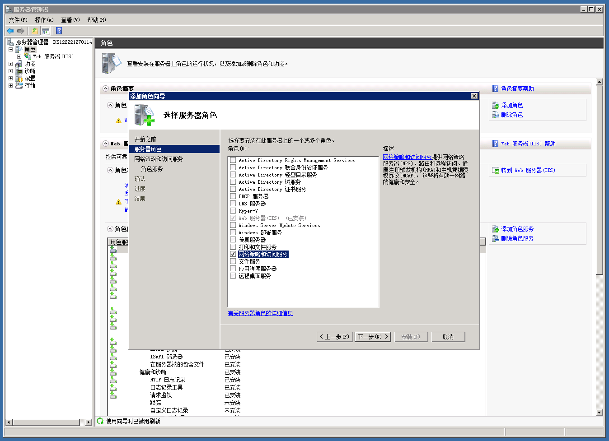
　　“角色服务”为“路由和远程访问服务”。
>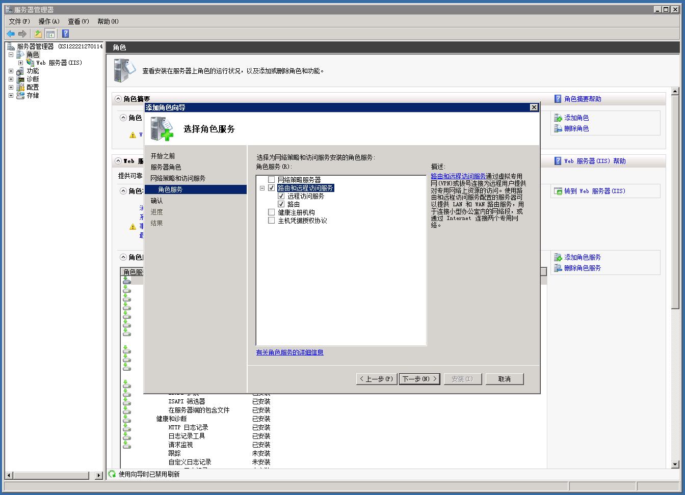
　　配置以“虚拟专用网络(VPN)访问和NAT”为例。这符合需要，也较简单。但选择此项之前需要再建立一块“网络适配器”，你可以去设备管理器中添加Loopback网卡。
>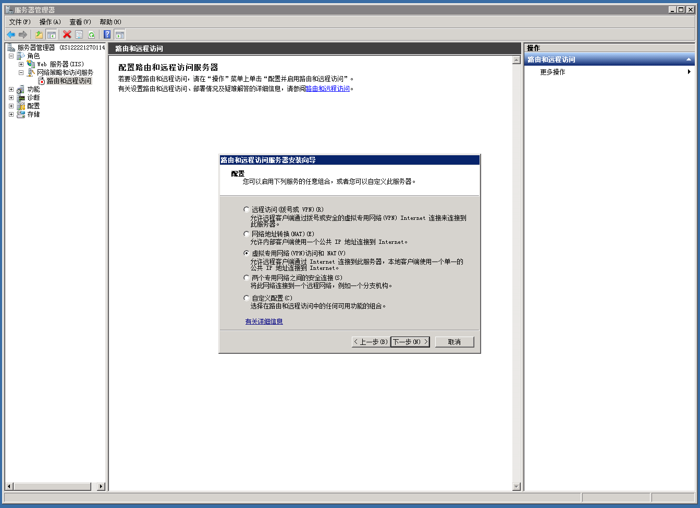
　　连接到Internet的网络接口自然选可以上外网的那块。但在这里配置似乎没用，等会还要再改。
>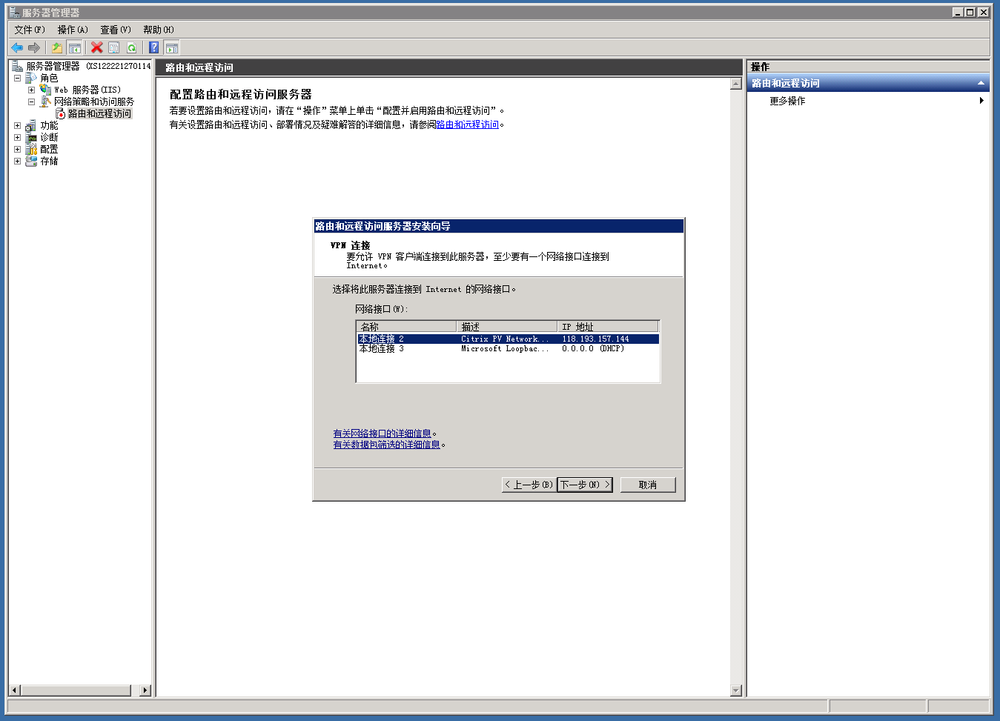
　　IP地址就自己随意分配好了。之后所有连到此VPN服务器的计算机都自动成为了它局域网中的客户端。
>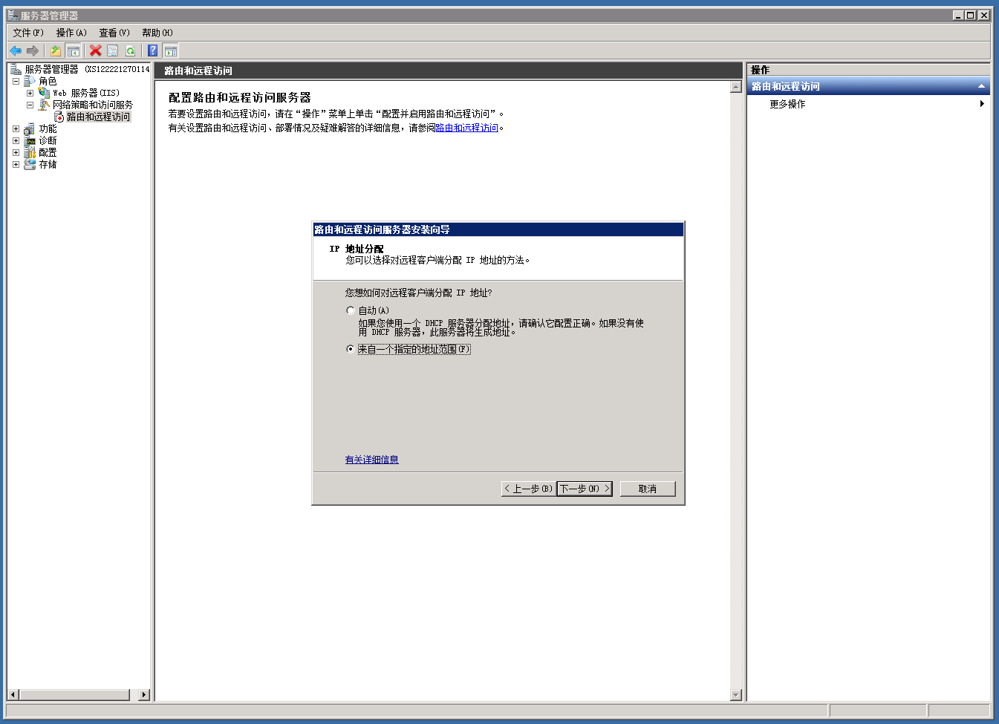
>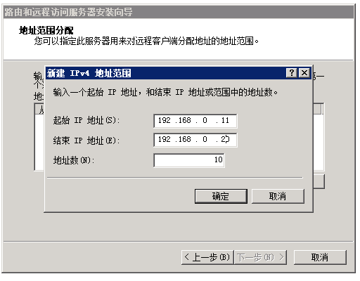
>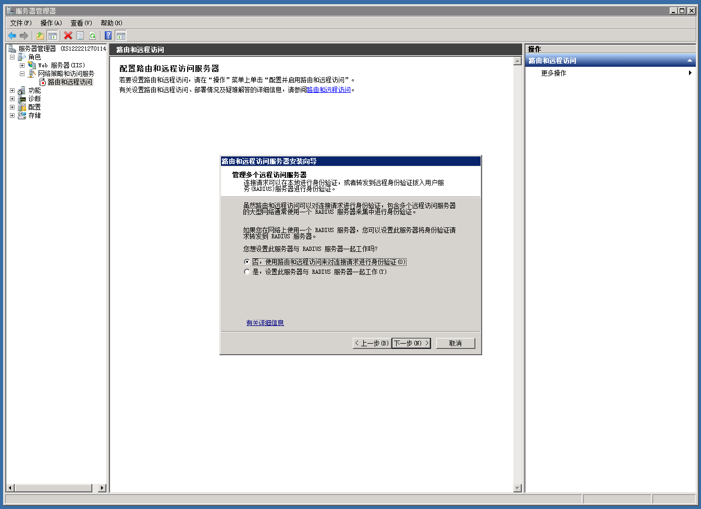
　　配置完成角色后，注意看它的“系统服务”是否处于运行状态。
>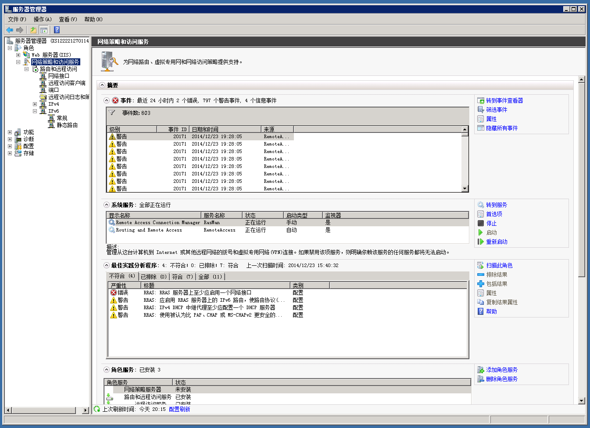
　　右键“路由和远程访问”属性。将IPv4的适配器改成该服务器上外网的网卡。
>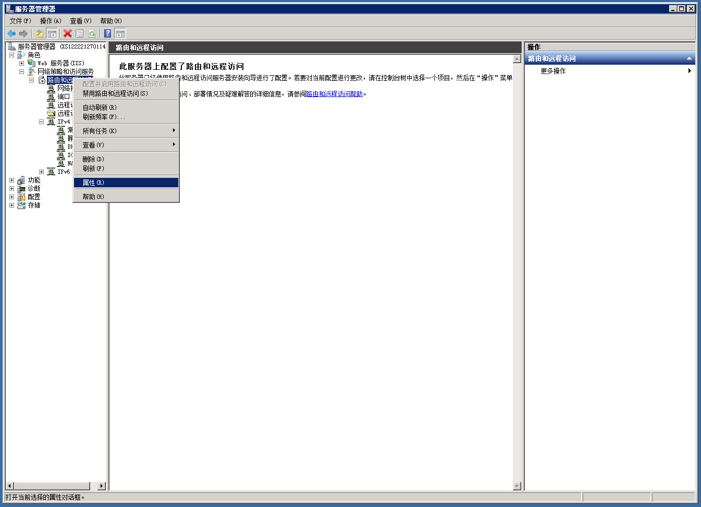
>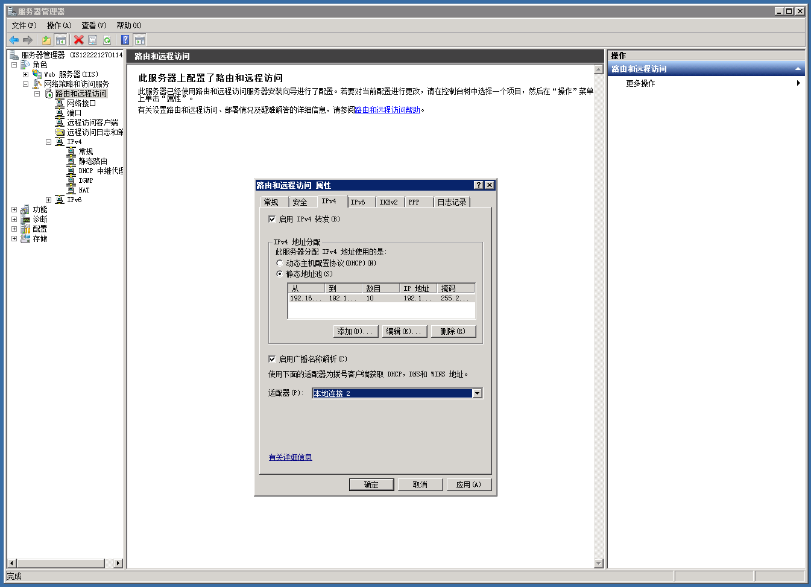
　　然后在创建新用户。“拨入”——“网络访问权限”——“允许访问”。然后这个帐号就可以用来连接VPN服务器了。
>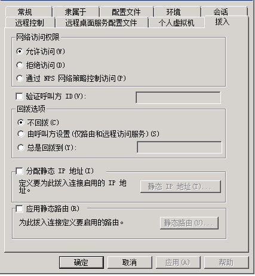
　　可用来访问外网的VPN服务器配置完毕。
##2. 解决外网IP不能远程连接的问题
　　VPN配置成功后遇到一个问题，用原来的外网IP不能连接该服务器的远程桌面了。可能是处于安全考虑，它现在禁止你用外网IP远程连接，只能在连上VPN后用VPN服务器的内网IP连接。如果你想像原来那样用外网IP，就需要改一下NAT的配置。
　　“路由和远程访问”——“IPv4”——“NAT”——右键上外网网卡看属性——“服务和端口”——勾选“Web服务器”。“专用地址”填本机“127.0.0.1”，将本机局域网IP转为外网IP。
>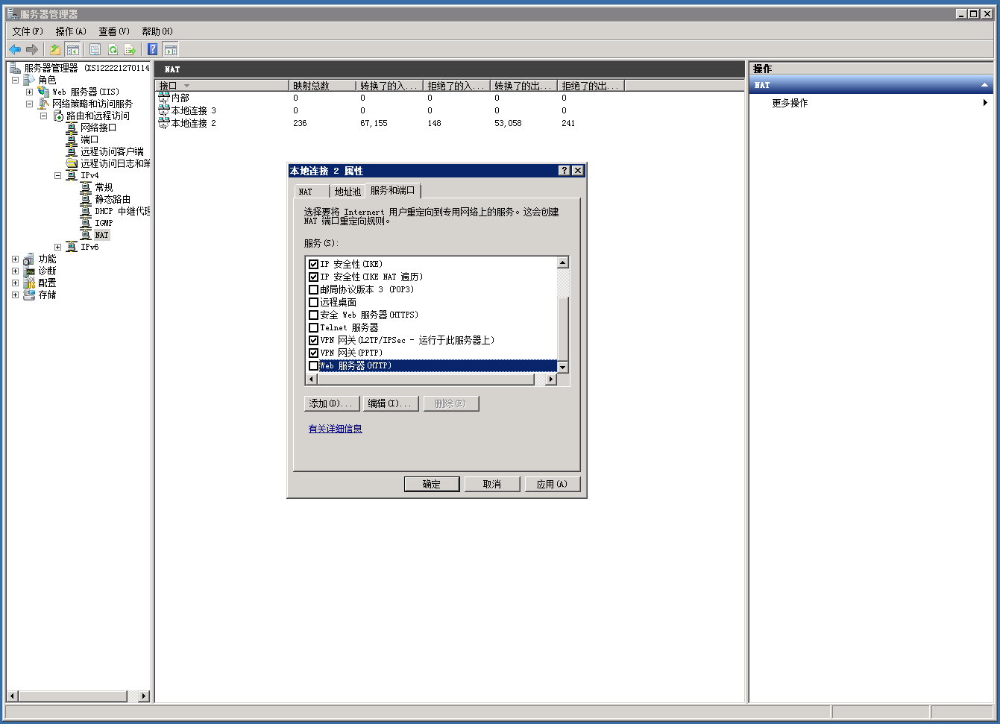
>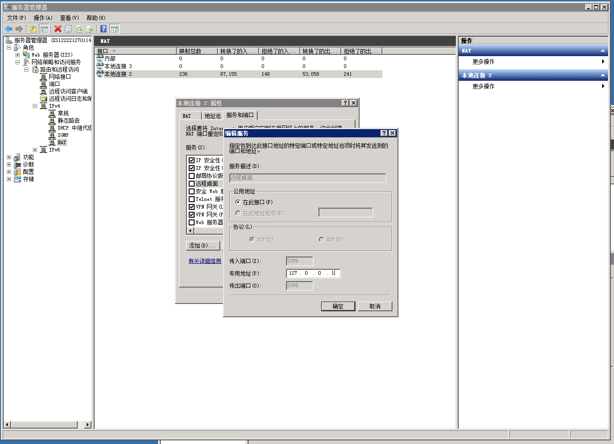
　　现在就可以像原来那样远程连接了。
　　
　　
1412232357
